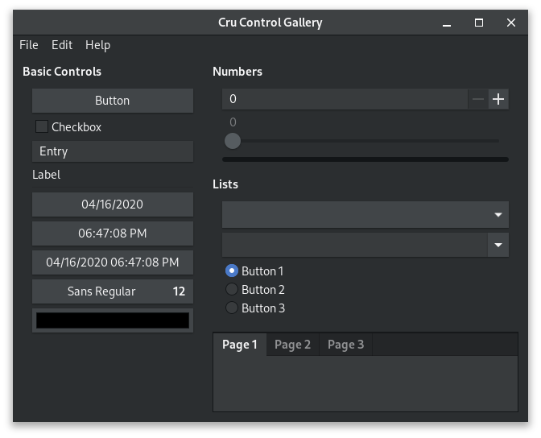

# Cru

<div align="center">
  
</div>

Cru is a basic UI framework based off of [Fusion/libui](https://github.com/Fusion/libui.cr) and [libui](https://github.com/andlabs/libui). Right now it's pretty barebones, and libui itself is still "mid alpha" software, but I hope it can eventually become a pretty decent GUI framework for Crystal.

## Installation

1. Install [libui](https://github.com/andlabs/libui)

2. Add the dependency to your `shard.yml`:

   ```yaml
   dependencies:
     cru:
       github: watzon/cru
   ```

3. Run `shards install`

## Usage

Check the [control_gallery](./examples/control_gallery.cr) example in the /examples folder.

## Contributing

1. Fork it (<https://github.com/watzon/cru/fork>)
2. Create your feature branch (`git checkout -b my-new-feature`)
3. Commit your changes (`git commit -am 'Add some feature'`)
4. Push to the branch (`git push origin my-new-feature`)
5. Create a new Pull Request

## Contributors

- [Chris Watzon](https://github.com/watzon) - creator and maintainer
